# 心理测评管理系统

## 介绍
心理测评管理系统是基于springboot以及vue开发的前端分离毕设项目。该项目包含三个使用角色，管理员、咨询师以及用户。
该系统分为两个前端和一个后端，两个前端分别是管理台页面和用户页面。
## 技术栈
- 后端：springboot、mybits
- 前端：vue、element-ui
- 数据库：mysql
- 开发工具：idea、vscode、maven、npm
## 使用角色
- 管理员：管理整个系统，包括其他角色以及功能。
- 咨询师：负责发布测评以及在线沟通。
- 用户：使用心理管理测评系统进行心理测评。

## 功能
- 注册登录：心理管理测评系统的用户可以使用注册登录登录来注册账号与登录，管理员和心理咨询师使用注册登录功能来登录系统。
- 用户管理：管理员登录成功后可以使用用户管理功能对系统中的用户进行管理。
- 咨询师管理：管理户登录成功后，可以使用咨询师管理系统对系统中的咨询师进行管理。
- 文章管理：咨询师登录后，可以使用文章管理系统发布管理文章。管理员成功登录系统以后可以使用文章管理功能管理系统中的文章。
- 心理测评模块：咨询师登录成功后可以使用心理测评模块向系统添加测评。用户登录成功以后可以使用心理测评系统对参与系统中发布的测评。管理员使用心理测评系统管理系统中所有的测评。
- 公告管理：管理员登录系统以后，可以使用公告管理功能来发布公告。咨询师与用户登录系统以后，可以查看系统中发布的公告。
- 在线咨询：咨询师登录成功后可以通过在线咨询功能开启在线咨询，用户登录系统以后可以看见系统中已经开启的在线咨询的心理咨询师，随后使用在线咨询功能向咨询师进行自在线咨询。
- 用户中心：用户对自己账号信息进行更新管理。

## 用户页面前端

<table>
    <tr>
        <td>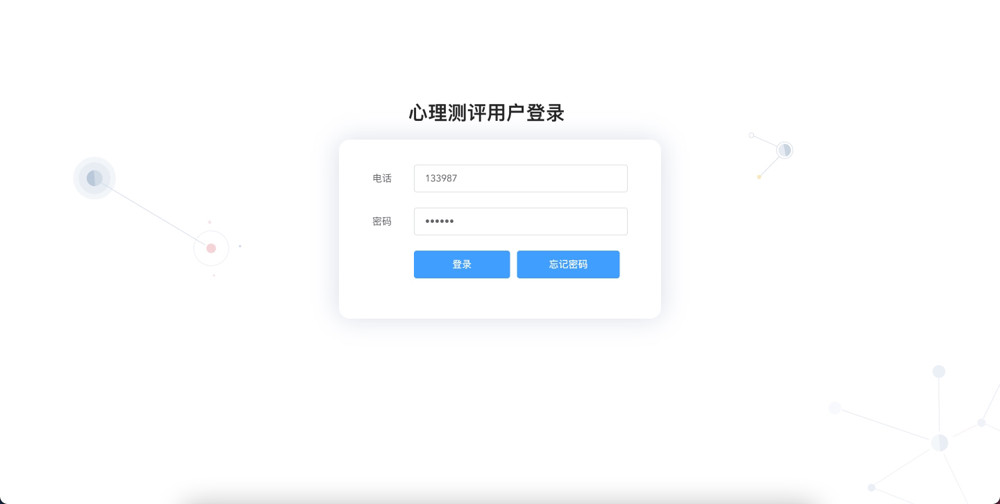</td>
        <td>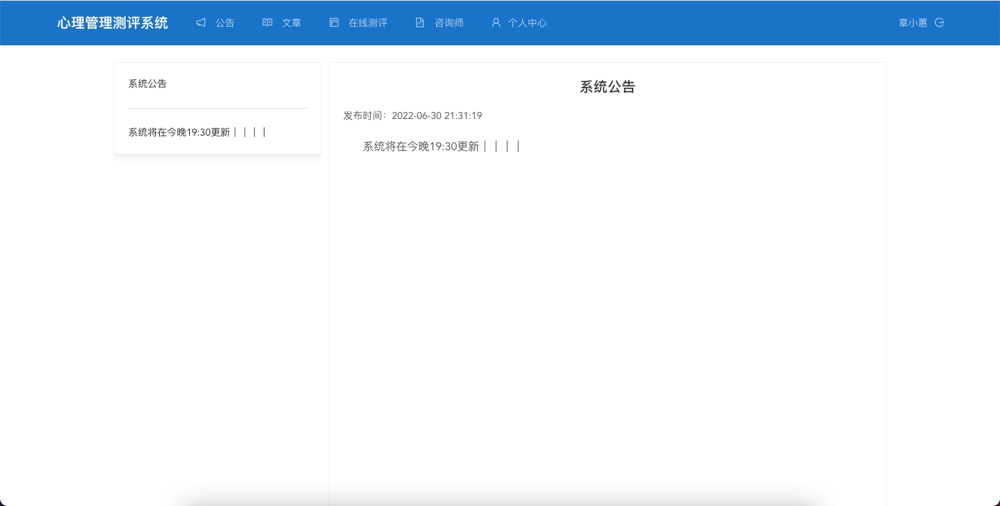</td>
    </tr>
</table>
<table>
    <tr>
        <td>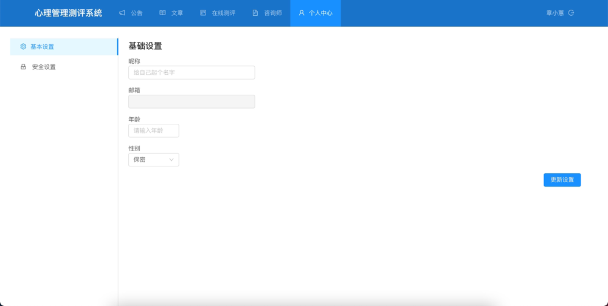</td>
        <td>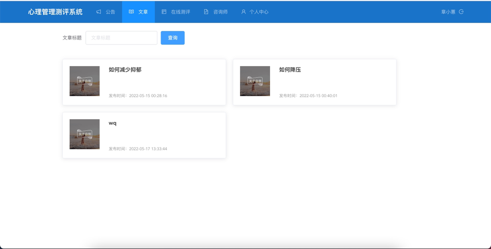</td>
    </tr>
</table>
<table>
    <tr>
        <td>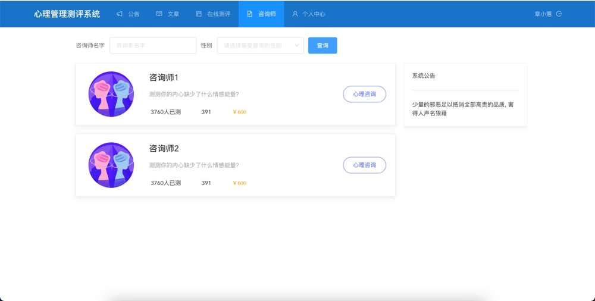</td>
        <td>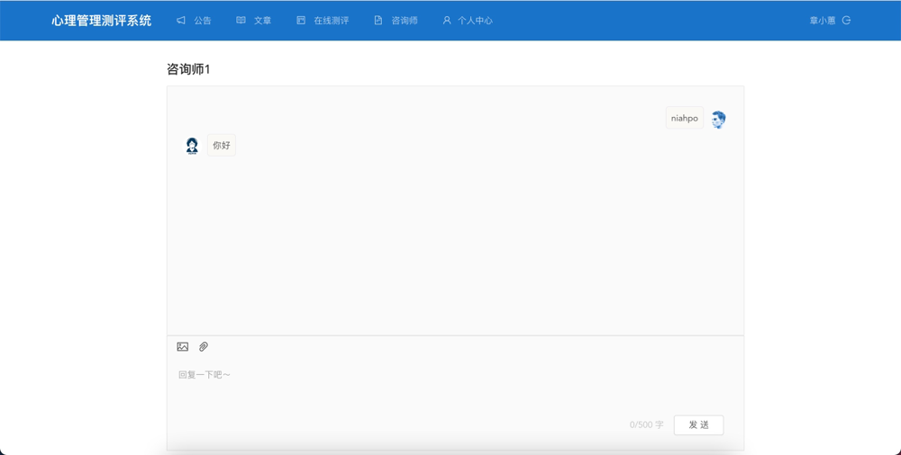</td>
    </tr>
</table>
<table>
    <tr>
        <td>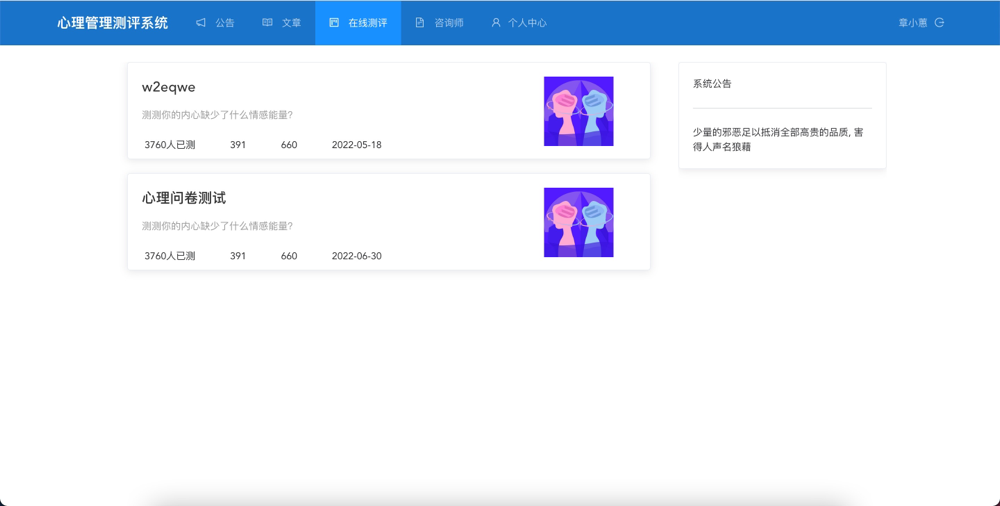</td>
        <td>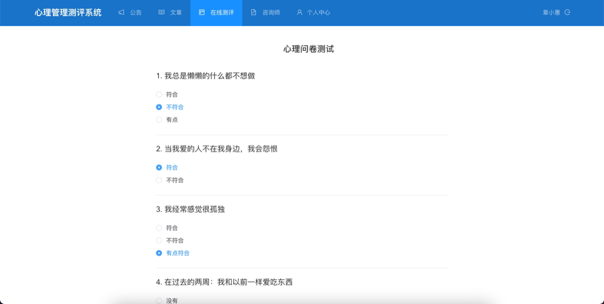</td>
    </tr>
</table>

## 管理页面前端

<table>
    <tr>
        <td>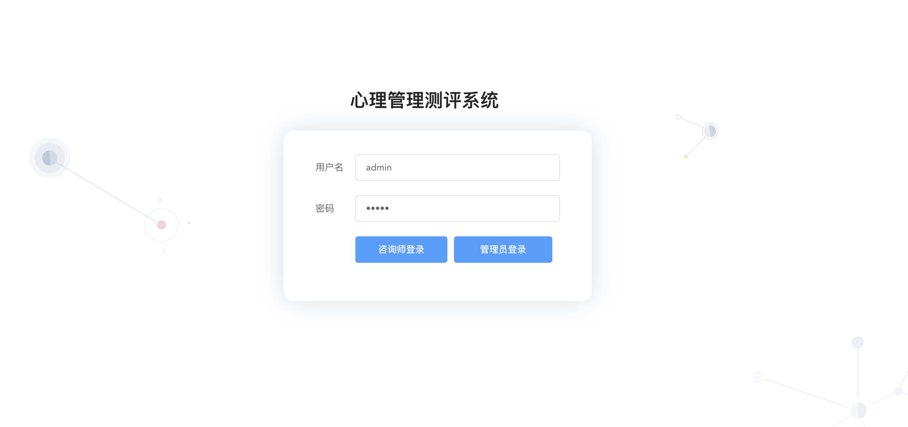</td>
        <td>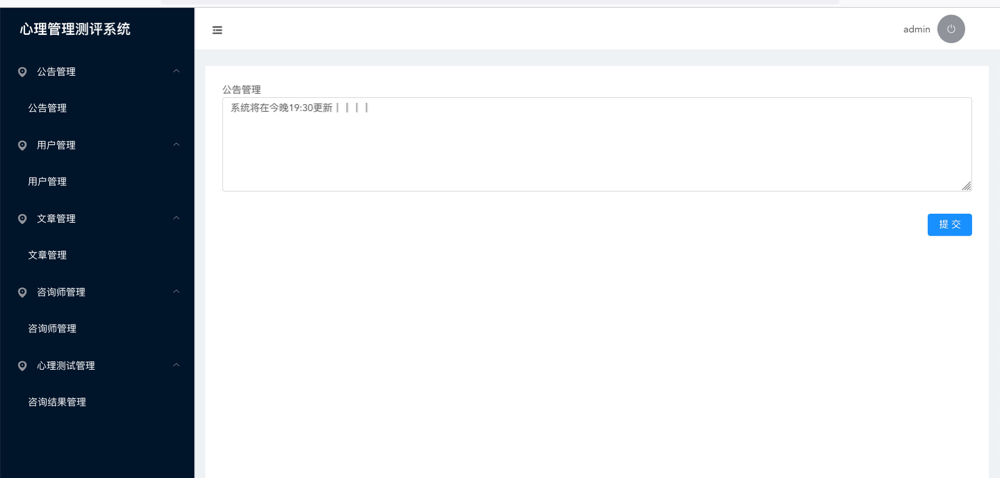</td>
    </tr>
</table>
<table>
    <tr>
        <td>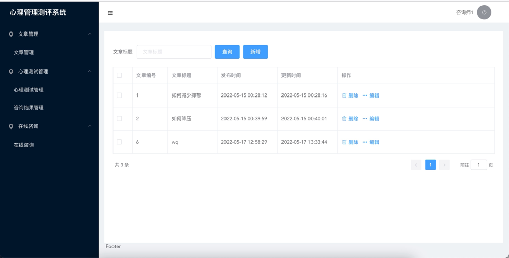</td>
        <td>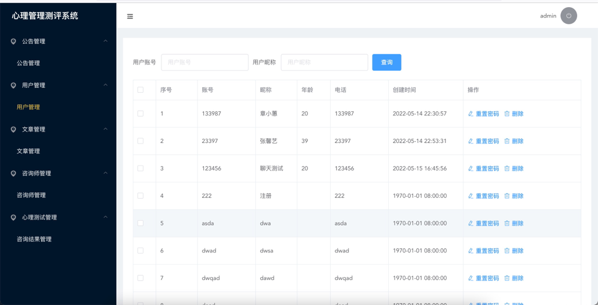</td>
    </tr>
</table>
<table>
    <tr>
        <td>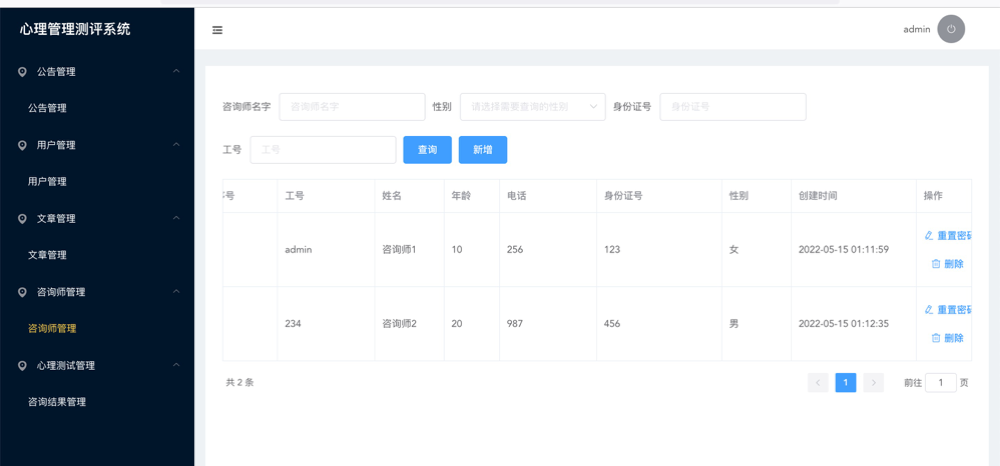</td>
        <td>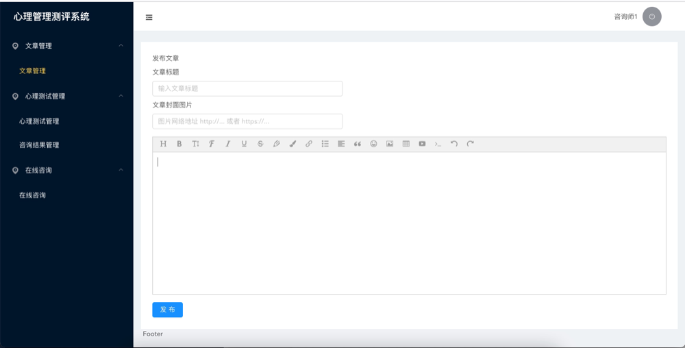</td>
    </tr>
</table>
<table>
    <tr>
        <td>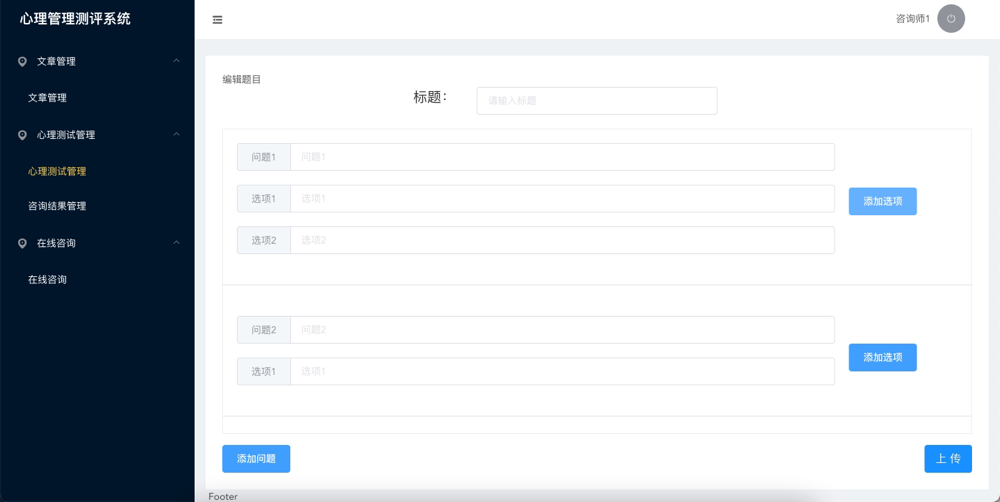</td>
        <td>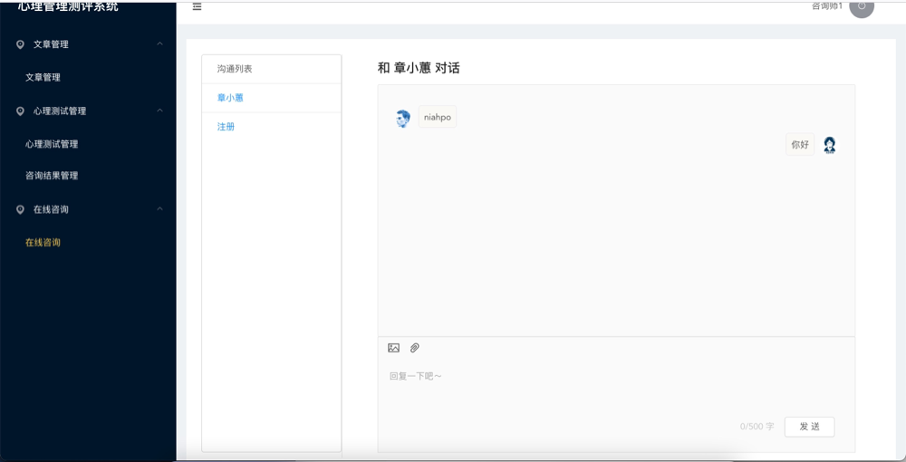</td>
    </tr>
</table>

## 相关项目地址
[用户前端项目地址](https://gitee.com/MrBaoLu/psy_user)

[管理前端项目地址]()


## 用户页面前端部署安装

下载安装npm
https://blog.csdn.net/weixin_45633243/article/details/121090379

### 修改配置文件
“vue.config.js”

修改配置文件vue.config.js，后端服务端口。
```
    module.exports = {
	devServer: {
		proxy: {
			"/api": {
				target: "http://localhost:8888",
				changeOrigin: true,
				ws:true,
				pathRewrite: {
					"^/api": ""
				}
			}
		}
	},
	css: {
        loaderOptions: {
            less: {
                javascriptEnabled: true
            }
        }
    }
}

```
### 下载依赖

```
npm install
```

### 运行服务
```
npm run serve
```

随后访问：http://localhost:8081/ 

## 联系作者

<b>作者wx：Yaoxiu121：</b><br>
<p></p>